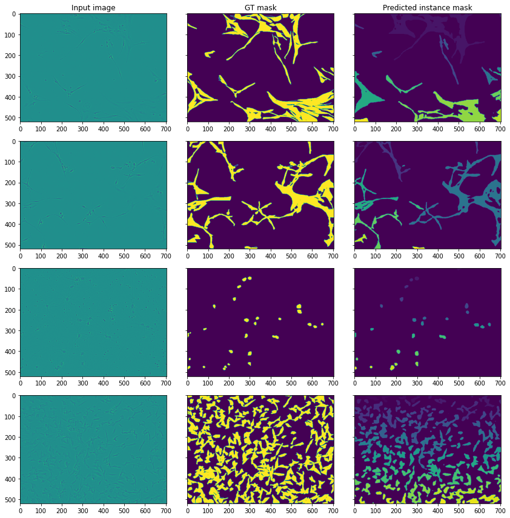

# Sartorius - Cell Instance Segmentation

Model for detection and delineating distinct objects of interest in biological images depicting neuronal cell types commonly used in the study of neurological disorders.   
Input data - phase contrast microscopy images, output - instance segmentation of neuronal cells.  
Training data is available on [competition page](https://www.kaggle.com/c/sartorius-cell-instance-segmentation).

## Inference example:
Inference example can be founded in the [notebook](./inference.ipynb).
